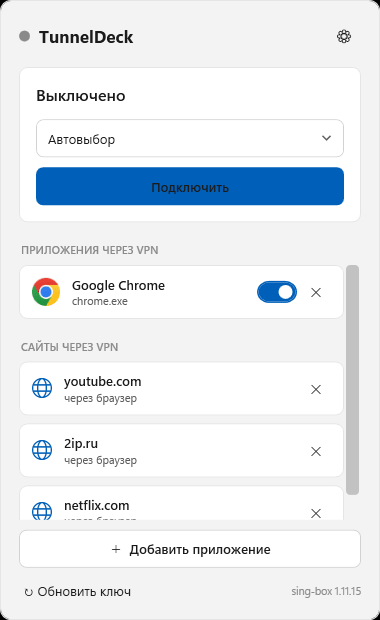
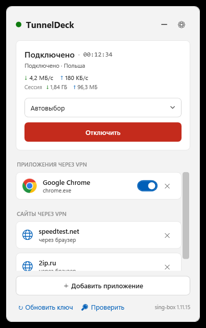
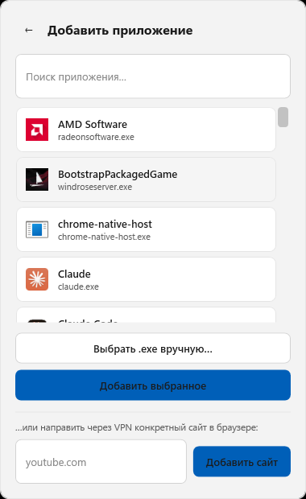
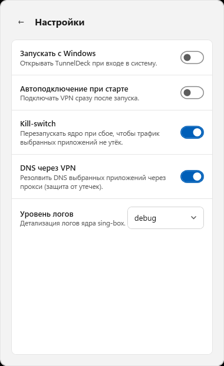

<div align="center">


# TunnelDeck

**Per-app VPN for Windows — send only the apps (and sites) you choose through the tunnel.**
A modern tray app that routes selected applications through your VLESS/Reality VPN, without touching everything else.


**English** · [Русский](README.ru.md)



</div>

---

## What it does

TunnelDeck lives in your system tray and gives you **split tunneling that actually respects the rest of your PC**. Pick which apps go through the VPN — the rest of your traffic (games, calls, everything else) keeps using your normal connection and is **never interrupted** when you connect or disconnect.

Unlike a normal VPN client that flips your whole machine, TunnelDeck redirects **only the processes you select** into a local proxy. There's no system-wide TUN adapter and no route-table surgery, so turning the VPN on/off won't drop your online game.

## Features

- 🎯 **Per-app routing** — choose exactly which apps go through the VPN; pick from running apps or browse to any `.exe`.
- 🌐 **Per-site routing** — send a specific website through the VPN (e.g. `youtube.com`) while the rest of the browser stays direct.
- 🎮 **Games never drop** — connecting/disconnecting doesn't touch the system routes, so apps that aren't tunneled keep their connections alive.
- 📈 **Live throughput** — see the tunnel's real ↓/↑ speed while connected.
- 🟢 **At-a-glance status** — the tray icon frames green (connected), amber (connecting) or red (off).
- 🔑 **One-paste setup** — paste your subscription link and TunnelDeck fetches the servers automatically (handles Happ-locked panels).
- 🪟 **Windows 11 UI** — clean light Fluent design, fully in Russian.
- 🚀 **Launch on login** — optional autostart to the tray.

## Screenshots

<table>
<tr>
<td><br/><b>Connected + live speed</b></td>
<td><br/><b>Add app / website</b></td>
<td><br/><b>Settings</b></td>
</tr>
</table>

## How per-site routing works

When you add a website, TunnelDeck routes your browsers through a second local proxy where sing-box inspects each connection's destination. Only the domains you listed take the VPN; everything else in the browser goes out directly. Browser QUIC (HTTP/3) is nudged to fall back to TCP so the destination can be read reliably. Installed browsers are detected automatically (Chrome, Edge, Firefox, Opera, Brave, Vivaldi, Yandex…).

## Install

1. Download **`TunnelDeck-Setup-1.2.2.exe`** from the [latest release](../../releases/latest) and run it.
   The installer sets up the app, a desktop + Start-menu shortcut, and the required network-filter driver.
2. Launch TunnelDeck (it opens from the tray icon).
3. Paste your **subscription key**, pick a server, add the apps/sites you want, and hit **Connect**.

> **Administrator & driver.** A per-app VPN needs to intercept traffic, so the app runs elevated and installs the **Windows Packet Filter** driver during setup. First launch also downloads the sing-box core (~12 MB).

> **SmartScreen note.** The build isn't signed by a trusted CA, so Windows SmartScreen may warn — click **More info → Run anyway**.

## How it works

- **Shell:** C# / .NET 8 **WPF** tray app with a borderless flyout window.
- **Tunnel core:** [sing-box](https://sing-box.sagernet.org/) runs as a local **SOCKS/mixed proxy** (no system TUN). It speaks **VLESS + Reality** to your server.
- **Per-app redirect:** [ProxiFyre](https://github.com/wiresock/proxifyre) (built on the **Windows Packet Filter** driver) transparently redirects the traffic of the selected processes into the local proxy — TCP and UDP.
- **Result:** because nothing rewrites the system routing table, connecting/disconnecting only starts/stops local processes, leaving all other apps untouched.

## Build from source

```bash
dotnet build TunnelDeck.sln -c Release
```

Portable single-file build:

```bash
dotnet publish src/TunnelDeck/TunnelDeck.csproj -c Release -r win-x64 --self-contained true -p:PublishSingleFile=true -p:IncludeNativeLibrariesForSelfExtract=true -p:EnableCompressionInSingleFile=true -o dist
```

## Installer

An [Inno Setup](https://jrsoftware.org/isinfo.php) script is provided at
[`installer/TunnelDeck.iss`](installer/TunnelDeck.iss). Building it with Inno Setup 6
(`ISCC.exe`) produces `TunnelDeck-Setup-1.1.0.exe` — it bundles ProxiFyre, silently
installs the Windows Packet Filter driver, creates shortcuts, and adds an uninstaller.

## Limitations

- Requires **Administrator** (driver-based traffic interception).
- Per-site routing covers **installed** browsers; portable/unregistered browsers aren't auto-detected.
- Speed is reported as **total tunnel throughput** — per-app byte accounting isn't available once traffic is redirected through the proxy.

## Credits

- Tunnel core: [sing-box](https://github.com/SagerNet/sing-box) (SagerNet).
- Per-app redirection: [ProxiFyre](https://github.com/wiresock/proxifyre) + [Windows Packet Filter](https://github.com/wiresock/ndisapi) (Wiresock / NT Kernel).

## License

[MIT](LICENSE) © 2026 vladbogun1
