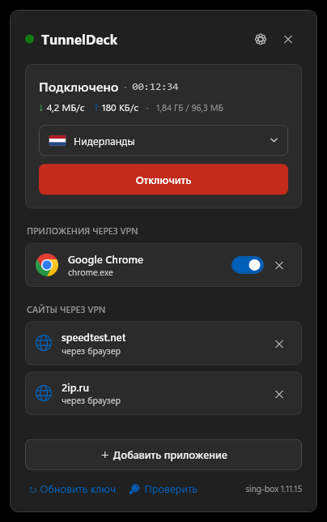

<div align="center">


# TunnelDeck

**Per-app VPN для Windows — через туннель идут только выбранные приложения (и сайты).**
Трей-приложение, которое направляет выбранные программы через ваш VLESS/Reality VPN, не трогая остальное.


[English](README.md) · **Русский**


</div>

---

## Что это

TunnelDeck живёт в системном трее и даёт **сплит-туннелинг, который не мешает остальному ПК**. Вы выбираете, какие приложения идут через VPN — весь остальной трафик (игры, звонки, всё прочее) продолжает работать напрямую и **не обрывается** при подключении/отключении.

В отличие от обычного VPN-клиента, который заворачивает всю систему, TunnelDeck перенаправляет **только выбранные процессы** в локальный прокси. Нет системного TUN-адаптера и правки таблицы маршрутов — поэтому вкл/выкл VPN не роняет вашу онлайн-игру.

## Возможности

- 🎯 **По приложениям** — выберите, какие программы идут через VPN; из списка запущенных или указав `.exe`.
- 🌐 **По сайтам** — направьте через VPN конкретный сайт (например `youtube.com`), а остальной браузер оставьте напрямую.
- 🎮 **Игры не рвутся** — вкл/выкл не трогает маршруты системы, нетуннелируемые приложения сохраняют соединения.
- 📈 **Живая статистика** — реальная скорость ↓/↑, длительность сессии и суммарный трафик за сеанс.
- 🌍 **Серверы с пингом и флагами** — цветные бейджи задержки и флаги стран; смена сервера прямо из иконки в трее.
- 🛰️ **Активные соединения** — видно, что прямо сейчас идёт через VPN.
- 🛡️ **Детектор утечки** — предупредит, если туннель упал или exit-IP совпал с вашим реальным.
- 🟢 **Статус с одного взгляда** — рамка иконки в трее: зелёная (подключено), жёлтая (подключается), красная (выключено).
- 🔑 **Настройка в одну вставку** — вставьте ключ-подписку, серверы подтянутся сами (умеет обходить Happ-lock). Поддержка VLESS/Reality, VMess, Trojan, Shadowsocks.
- ⬆️ **Авто-обновление** — уведомит о новой версии и обновит в один клик, со ссылкой «Что нового».
- 🪟 **Интерфейс Windows 11** — аккуратный Fluent, **светлая и тёмная** тема (следует системной), на **русском или английском** с переключателем.
- 🚀 **Запуск при входе** — опциональный автозапуск в трей.

## Скриншоты

<table>
<tr>
<td><br/><b>Подключено + статистика</b></td>
<td><br/><b>Добавить приложение / сайт</b></td>
<td><br/><b>Тёмная тема</b></td>
</tr>
</table>

## Как работает режим «сайт через VPN»

Когда вы добавляете сайт, браузеры заворачиваются во второй локальный прокси, где sing-box смотрит адрес назначения каждого соединения. Через VPN идут только перечисленные домены, остальное браузера — напрямую. QUIC (HTTP/3) браузера мягко откатывается на TCP, чтобы адрес читался надёжно. Установленные браузеры определяются автоматически (Chrome, Edge, Firefox, Opera, Brave, Vivaldi, Яндекс…).

## Установка

1. Скачайте **`TunnelDeck-Setup-1.3.2.exe`** из [последнего релиза](../../releases/latest) и запустите.
   Установщик поставит приложение, ярлык на рабочий стол и в меню Пуск, и необходимый сетевой драйвер.
2. Запустите TunnelDeck (открывается из иконки в трее).
3. Вставьте **ключ подписки**, выберите сервер, добавьте приложения/сайты и нажмите **Подключить**.

> **Права администратора и драйвер.** Per-app VPN должен перехватывать трафик, поэтому приложение работает с правами админа и ставит драйвер **Windows Packet Filter** при установке. Установщик заводит задачу «с наивысшими правами» в Планировщике — после установки TunnelDeck запускается с правами **без запроса UAC** каждый раз. При первом запуске также скачивается ядро sing-box (~12 МБ).

> **SmartScreen.** Сборка без доверенной подписи — Windows может предупредить: **Подробнее → Выполнить в любом случае**.

## Как это устроено

- **Оболочка:** C# / .NET 8 **WPF**, трей-приложение с безрамочным флайаутом.
- **Ядро туннеля:** [sing-box](https://sing-box.sagernet.org/) как локальный **SOCKS/mixed-прокси** (без системного TUN), протокол **VLESS + Reality** (плюс vmess/trojan/shadowsocks).
- **Перехват по приложениям:** [ProxiFyre](https://github.com/wiresock/proxifyre) (на драйвере **Windows Packet Filter**) прозрачно заворачивает трафик выбранных процессов в локальный прокси — TCP и UDP.
- **Повышение прав без UAC:** приложение помечено `asInvoker`; задача Планировщика «с наивысшими правами» (заводится установщиком) запускает его повышенным по требованию — без запроса UAC при каждом старте.
- **Итог:** ничего не переписывает таблицу маршрутов, поэтому вкл/выкл лишь запускает/останавливает локальные процессы, не трогая остальные приложения.

## Сборка из исходников

```bash
dotnet build TunnelDeck.sln -c Release
```

Установщик собирается из self-contained сборки:

```bash
dotnet publish src/TunnelDeck/TunnelDeck.csproj -c Release -r win-x64 --self-contained true -p:PublishSingleFile=true -p:IncludeNativeLibrariesForSelfExtract=true -p:EnableCompressionInSingleFile=true -o dist
```

> TunnelDeck рассчитан на установку через установщик — задача для запуска без UAC и сетевой драйвер настраиваются им. Запуск «голого» `.exe` не поддерживается.

## Ограничения

- Требуются **права администратора** (перехват трафика через драйвер).
- Режим «сайт» покрывает **установленные** браузеры; портативные не определяются автоматически.
- Скорость показывается **суммарная по туннелю** — учёт байт по конкретному приложению недоступен после редиректа в прокси.

## Благодарности

- Ядро туннеля: [sing-box](https://github.com/SagerNet/sing-box) (SagerNet).
- Перехват по приложениям: [ProxiFyre](https://github.com/wiresock/proxifyre) + [Windows Packet Filter](https://github.com/wiresock/ndisapi) (Wiresock / NT Kernel).

## Лицензия

[MIT](LICENSE) © 2026 vladbogun1
